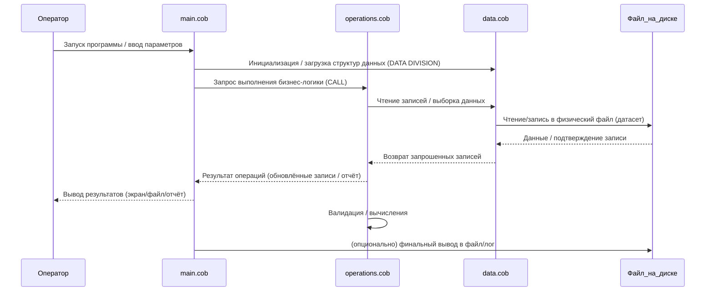

# Диаграмма последовательности — поток данных приложения

Ниже показана диаграмма последовательности (Mermaid) демонстрирующая поток данных между модулями COBOL в репозитории (`main.cob`, `operations.cob`, `data.cob`) и файловой системой/вводом-выводом.

Краткие пояснения:
- **Оператор (User)**: запускает программу (CLI/панель операторов).
- **main.cob**: точка входа; координирует и вызывает операции.
- **operations.cob**: реализует бизнес-логику и трансформации данных.
- **data.cob**: определяет структуры данных и операции чтения/записи.
- **Файл на диске (FS)**: физическое хранилище (COBOL dataset / файл).

Как использовать:
- Вставьте этот файл в `docs/README.md` (уже сделано).
- GitHub и рендереры Markdown с поддержкой Mermaid отобразят диаграмму автоматически.

Если хотите, могу уточнить диаграмму, добавив конкретные вызовы (например, имена процедур из `main.cob`), или вставить эту же диаграмму в конец основного `README.md`.
